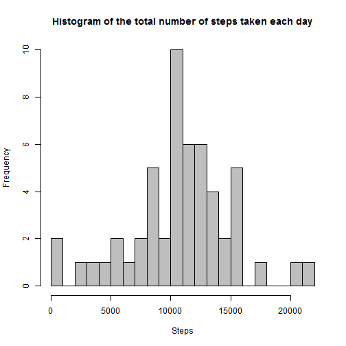
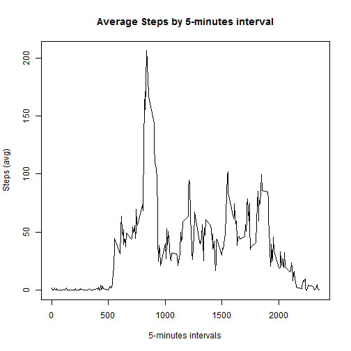
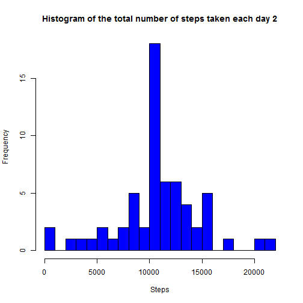
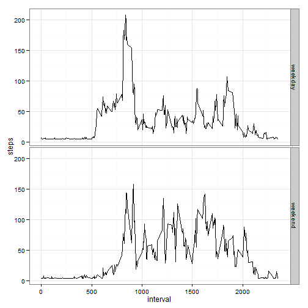

## Loading and preprocessing the data

Load the data


```r
data <- read.csv("activity.csv")
```

Process/transform the data (if necessary) into a format suitable for your analysis


```r
data$date <- as.Date(data$date,'%Y-%m-%d')
```


## What is mean total number of steps taken per day?

Make a histogram of the total number of steps taken each day


```r
stepsByDay <- aggregate(steps ~ date, sum, data=data, na.rm=TRUE)
hist(stepsByDay$steps, breaks=20, main="Histogram of the total number of steps taken each day", xlab="Steps", col="grey")
```

 

Calculate and report the mean and median total number of steps taken per day


```r
mean(stepsByDay$steps)
```

```
## [1] 10766
```

```r
median(stepsByDay$steps)
```

```
## [1] 10765
```

## What is the average daily activity pattern?

Make a time series plot (i.e. type = "l") of the 5-minute interval (x-axis) and the average number of steps taken, averaged across all days (y-axis)


```r
averageStepsByInterval <- with(data, tapply(steps, interval, mean, na.rm=TRUE))
plot(names(averageStepsByInterval),averageStepsByInterval,type = "l",
        main = "Average Steps by 5-minutes interval",
        xlab = "5-minutes intervals",ylab= "Steps (avg)")
```

 

Which 5-minute interval, on average across all the days in the dataset, contains the maximum number of steps?


```r
for (i in 1:length(averageStepsByInterval))  {
        if (averageStepsByInterval[i] == max(averageStepsByInterval)) {
                print(i)
        }
        else {i = i + 1}       
}
```

```
## [1] 104
```

## Imputing missing values

Calculate and report the total number of missing values in the dataset


```r
length(data$steps[is.na(data$steps)])
```

```
## [1] 2304
```

Devise a strategy for filling in all of the missing values in the dataset


```r
stepswtNA <- data$steps

for (i in 1:length(stepswtNA)) {
        if ( is.na(stepswtNA[i]) == TRUE ) {
                stepswtNA[i] <- mean(averageStepsByInterval)
        }
}       
```

Create a new dataset that is equal to the original dataset but with the missing data filled in


```r
data2 <- data
data2$steps <- stepswtNA
length(data2$steps[is.na(data2$steps)])
```

```
## [1] 0
```

Make a histogram of the total number of steps taken each day and Calculate and report the mean and median total number of steps taken per day


```r
stepsByDay2 <- aggregate(steps ~ date, sum, data=data2, na.rm=TRUE)
hist(stepsByDay2$steps, breaks=20, main="Histogram of the total number of steps taken each day 2", xlab="Steps", col="blue")
```

 

```r
mean(stepsByDay2$steps)
```

```
## [1] 10766
```

```r
median(stepsByDay2$steps)
```

```
## [1] 10766
```


## Are there differences in activity patterns between weekdays and weekends?

Create a new factor variable in the dataset with two levels - "weekday" and "weekend" indicating whether a given date is a weekday or weekend day.


```r
weekday <- weekdays(as.Date(data2$date)) 
weekday[which(weekday=="Saturday"|weekday=="Sunday")]<-"weekend"
weekday[which(weekday!="weekend")]<-"weekday"
weekday<-as.factor(weekday)
data2 <- cbind(data2, weekday)
```

Make a panel plot containing a time series plot (i.e. type = "l") of the 5-minute interval (x-axis) and the average number of steps taken, averaged across all weekday days or weekend days (y-axis)


```r
averageStepsByInterval2<-aggregate(steps~interval+weekday,mean,data=data2)

library(ggplot2)
```

```
## Warning: package 'ggplot2' was built under R version 3.1.2
```

```r
g <- ggplot(averageStepsByInterval2,aes(x=interval,y=steps))
g <- g+geom_line()+facet_grid(weekday~.)+theme_bw()
g
```

 


